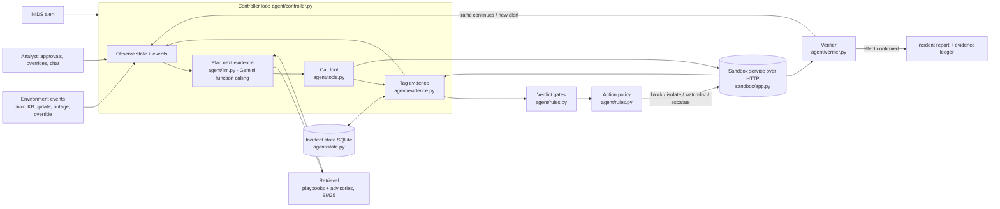

# SOCrates architecture

This document maps every box the hackathon asks for (agent/controller, tools, external systems,
memory/state, retrieval, planning, evaluation/verification, human interaction, failure handling) to a
concrete module in the repository.

## 1. Big picture

Two processes: the **sandbox** (the simulated enterprise: alerts, flows, assets, CVE KB, logs, firewall,
tickets) and the **agent**. The agent has no in-process access to the sandbox; every tool call is an HTTP
request through `SandboxClient`. In tests and the CLI the same API is served in-process by Starlette's
test client, so the boundary is identical.

## 2. The loop, step by step

1. **Drain events.** `GET /events` — new alerts, analyst overrides, advisory revisions. Each becomes an
   observation in the history and may reopen a closed incident or bump the *epoch* (which marks
   knowledge-dependent calls as stale).
2. **Budget check.** Past `STEP_BUDGET` the agent escalates with the partial ledger rather than guessing.
3. **Plan.** The planner sees the full history (tool calls, results, events) and the evidence ledger and
   returns one function call: an evidence tool or `conclude_investigation`. Gemini is asked with
   `functionCallingConfig.mode = ANY`, so it must act.
4. **Act + tag.** The tool runs with 3 retries on 429/5xx. Results are tagged deterministically
   (`evidence.py`): per-CVE success indicators from the KB, generic post-exploitation signatures
   (`Accepted password`, `spawned child=/bin/sh`, outbound callbacks, `?cmd=`), block signatures (403, WAF
   BLOCK), vulnerability range checks. Every evidence item has an id (`E7`), a category, the source call
   and the raw excerpt.
5. **Conclude → gate.** The planner's verdict is checked against the ledger (`rules.gate_verdict`):
   SUCCEEDED needs ≥1 `post_exploitation` item; FAILED needs a block/reject item or a not-vulnerable
   version and zero post-exploitation items; unknown asset forces INCONCLUSIVE; a degraded evidence path
   caps confidence at 0.6. The assessment is filed to the ticketing system.
6. **Actions → policy.** `rules.decide_actions` turns the proposal into gated actions: block only on
   SUCCEEDED with confidence ≥0.7 and a non-allow-listed source; critical assets and host isolation need
   approval; FAILED goes to the watch-list; INCONCLUSIVE escalates with the missing evidence named.
7. **Perform + verify.** After a block, `verifier.verify_block` re-queries the firewall: rule present?
   flows from the source since? new alerts on the same host? A failed verification or a correlated new
   alert re-enters the loop (that is how the S2 pivot is caught).
8. **Persist.** The incident (state, ledger, history, trace) is written to SQLite after every step, so a
   crashed or paused run (awaiting approval) resumes from where it stopped.

## 3. Components and responsibilities

| Box in the brief | Module | Notes |
|---|---|---|
| Agent / controller | `agent/controller.py` | single loop, one incident at a time; owns trace + persistence |
| Planning | `agent/llm.py` (`GeminiLLM`) | native function calling; conversation rebuilt from history each step; `MockLLM` is a scripted playbook follower for offline tests / demo fallback |
| Tools | `agent/tools.py` | Gemini schemas for evidence tools + `conclude_investigation`; HTTP client for everything, including actions the planner may not call directly |
| External systems | `sandbox/` | alert feed, flows, asset inventory, CVE KB, host logs, firewall, host control, ticketing, allow-list; all state-changing calls are real inside the simulator |
| Retrieval | `sandbox/retrieval.py`, `search_playbooks` | BM25 over response playbooks and advisories; the planner uses the playbook's evidence plan to decide what to search |
| Memory / state | `agent/state.py` | `Incident` (hypotheses, evidence ledger, history, actions, overrides, verification results), SQLite store |
| Evaluation / verification | `agent/rules.py`, `agent/verifier.py`, `eval/` | verdict gates, action policy, post-action verification, scenario scoring harness |
| Human interaction | `Controller.approve`, override events, `cli_approver` | approval gate for high-impact actions; analyst override unblocks, records the exception and revises the assessment; chat panel arrives with the UI |
| Failure handling | `tools.SandboxClient._req`, controller `_execute` / `_decide` | retries with backoff; log outage → continue with other sources, cap confidence, lift the cap when logs return; planner failure → rule-only conclusion; budget exhaustion → escalate; firewall refusal → escalate for manual containment |

## 4. Where autonomy sits, and where it does not

The **LLM decides**: which evidence to fetch next, when it is sufficient, what the verdict is, and which
response to propose. That is the branching, multi-step part and it is different for every scenario.

The **rules decide only** whether the evidence supports the claim and whether the action is safe. They
can downgrade, cap, refuse, or require approval. They cannot choose an action the planner did not propose.
The trace shows both: `DECISION` lines are the planner's; `GUARDRAIL` lines say "passed", "downgraded",
"refused" or "approval required".

## 5. The sandbox as a test bench

Scenario files carry three things beyond data:

- **triggers** — environment reactions to agent actions (`on: block_ip` → attacker pivots or analyst
  overrides; `on: file_assessment` → advisory revised and the attacker's second stage lands in the logs).
  This makes adaptation reproducible without a human clicking at the right moment.
- **faults** — make a tool fail the first N calls (`search_logs` returns 503 four times in S3).
- **expected** — ground truth for the eval harness (verdict, blocked IPs, escalation, assessment sequence,
  IPs that must never be blocked).

`POST /chaos/{kind}` exposes the same reactions as one-click actions for the UI.

## 6. Extending to a new domain (Stage 2)

Only three things are SOC-specific: the sandbox stores, the evidence tagger's indicator lists, and the
prompts. The controller loop, tool registry pattern, gates-outside-the-LLM structure, verifier hook,
event drain, approval flow and persistence are domain-agnostic. To re-target: write a new sandbox with a
handful of tools, a tagger for the new evidence types, and a system prompt; keep the loop.
